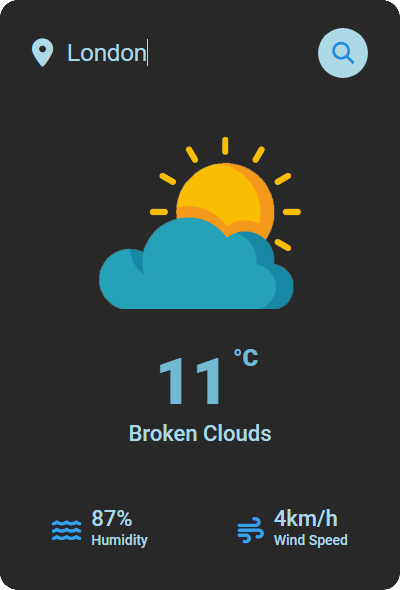
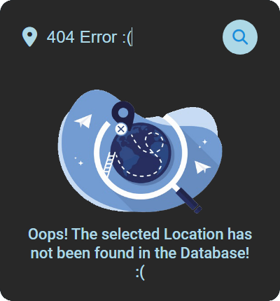

<h1 align="center">
  Modern Designed Weather App
</h1>

Using the free API of OpenWeatherMap, JavaScript and CSS I've designed a modern, *fancy*, Weather App. :)

      

<h2 align="center">Preview Images:</h2>

(If you want white-mode, I included support for that!)

 

  

 

  

 

  

